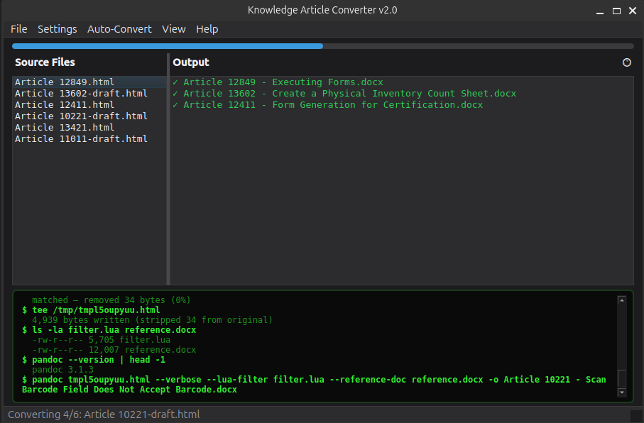
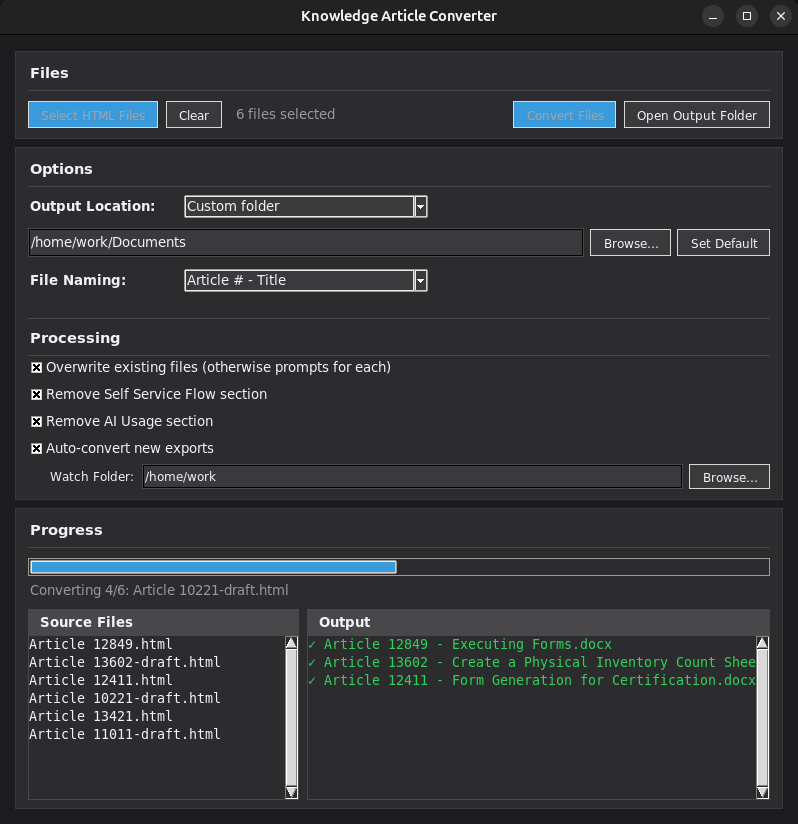

# Knowledge Article Converter

A two-part automation toolkit that eliminates manual busywork when publishing internal knowledge base articles to Word format.


---

## The problem

Publishing articles from a browser-based knowledge management system to `.docx` for distribution was a multi-step manual process: navigate to the export page, wait for it to load, click the export button, save the file, then open a separate tool to reformat it to match the house style. Multiply that across dozens of articles per sprint, across a team. It was slow, repetitive, and a constant source of formatting inconsistencies.

---

## The solution

Two tools that work together to reduce the entire workflow to a single click.

```
[ KB Article Editor ]
        │
        │  Tampermonkey userscript intercepts the export page
        │  and auto-clicks — no manual step required
        ▼
[ HTML file lands in watched folder ]
        │
        │  PyQt6 watchdog app detects the new file instantly
        │  and triggers pandoc conversion
        ▼
[ Formatted .docx — ready to distribute ]
```

### 1. Browser-side: Tampermonkey userscript

`tampermonkey/auto_export.js` runs in the browser on the knowledge base word export page. When the page loads, it automatically clicks the export button and closes the tab. The author never manually interacts with the export flow — triggering the export from the article editor is sufficient.

### 2. Desktop: PyQt6 converter app

`converter/knowledge_article_converter.py` is a desktop app that watches a local folder using `watchdog`. The moment an exported HTML file lands, it:

- Runs pandoc with a custom `reference.docx` template to enforce house style
- Applies a Lua filter to handle HTML highlight spans that pandoc doesn't natively support
- Displays a live conversion log in a CRT-style terminal panel with real-time status

The result: click export in the browser, a correctly formatted Word document appears on disk. Done.

---

## Screenshots

**v2.0** — PyQt6 rewrite with dark UI, splitter layout, and CRT-style terminal log



**v1.x** — Original tkinter version, settings-forward UI



---

## Components

| File | Role |
|------|------|
| `tampermonkey/auto_export.js` | Tampermonkey userscript — auto-clicks export in the browser |
| `converter/knowledge_article_converter.py` | PyQt6 app — watches folder, converts HTML → .docx via pandoc |
| `converter/filter.lua` | Pandoc Lua filter — maps HTML `background-color` spans to Word highlights |
| `converter/reference.docx` | Word template enforcing house style (headings, fonts, spacing) |
| `pandoc-patch/Docx.hs` | Patched pandoc source — fixes list numbering and indent alignment |

---

## The pandoc patch

Pandoc's default Word output has two list formatting behaviours that conflicted with the knowledge base style guide:

1. **Cycling numbering styles** — nested lists cycle through decimal → letters → Roman numerals by default. The style guide requires decimal at every level.
2. **Inconsistent hanging indent** — the default `hang` value shifts wide step numbers (e.g. `2.22`) further right than narrower ones, breaking visual alignment in long procedures.

Rather than post-process every output file, both issues are fixed at the source. See [`pandoc-patch/PATCH_NOTES.md`](pandoc-patch/PATCH_NOTES.md) for the specific changes and rationale.

---

## Tech stack

- **Python 3 / PyQt6** — desktop app and UI
- **pandoc** — HTML → DOCX conversion engine (with patched Haskell source)
- **Lua** — pandoc filter for highlight span handling
- **watchdog** — filesystem event monitoring
- **JavaScript** — Tampermonkey browser userscript

---

## Setup

### Prerequisites

- Python 3.10+
- pandoc (build from patched source — see `pandoc-patch/`)
- Tampermonkey browser extension

### Converter app

```bash
pip install PyQt6 watchdog
python converter/knowledge_article_converter.py
```

### Tampermonkey userscript

1. Install the [Tampermonkey](https://www.tampermonkey.net/) browser extension
2. Create a new script and paste the contents of `tampermonkey/auto_export.js`
3. Update the `@match` directive at the top to point to your knowledge base's word export URL
4. Save and enable the script

### Pandoc patch

The patched binary must be compiled from source. See [`pandoc-patch/PATCH_NOTES.md`](pandoc-patch/PATCH_NOTES.md) for build instructions.

---

## License

GPL v3 — see [LICENSE](LICENSE) for details.

This project uses [PyQt6](https://riverbankcomputing.com/software/pyqt/), licensed under GPL v3 by Riverbank Computing. All components in this repository are distributed under GPL v3 accordingly.
